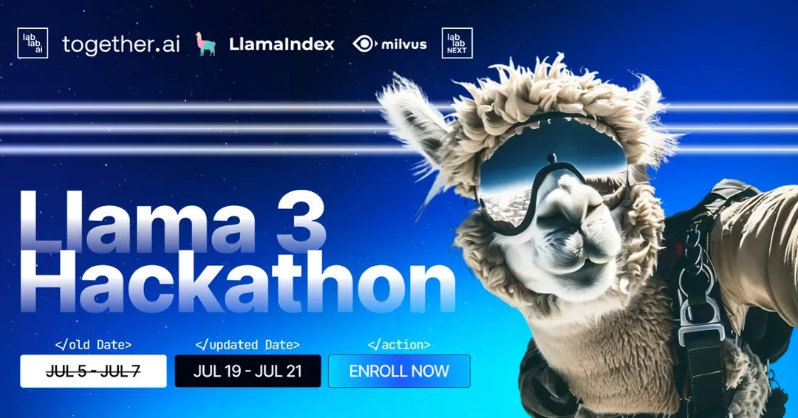

# Agent Roll Cage (ARC) V0.1


## Welcome to the Llama 3 Hackathon!
Get ready for an exciting adventure in app development with Llama 3 - join us for our online AI hackathon!

⌚ Dive into a 48-hour journey of creativity.

🚀 Compete to craft an app supercharged by Llama 3.

🎓 Expert mentors will guide you every step of the way.

🏆 Win an opportunity to participate in the Lablab NEXT acceleration program, exciting cash prizes, credits, and gear from LlamaIndex, Together AI & Zilliz.
***[🦾LabLab.ai Llama3 Hackathon🦿](https://lablab.ai/event/llama-3-ai-hackathon)



## About Llama 3
Introducing the New 8B and 70B Parameter Llama 3 Models. Llama 3 represents a major leap over Llama 2, establishing a new state-of-the-art for large language models (LLMs) at these scales.

🚀 **State-of-the-Art Performance:**
- Best models available today at the 8B and 70B parameter scale.

🎛️ **Greater Steerability:**
- More controllable and adaptable model responses.

🔄 **Enhanced Pretraining and Post-Training:**
- Substantially reduced false refusal rates.
- Improved alignment and increased diversity in model responses.

💡 **Improved Capabilities:**
- Enhanced reasoning.
- Advanced code generation.
- Better instruction following.

🧑🏻‍💻 Sign up before the Kick-Off Stream to secure your spot!

[Sign Up Here](https://www.linkedin.com/pulse/building-agentic-action-space-frameworks-willfreeai-8enre/?trackingId=MEw0Xp7tQM%2BNUrjbjTLCvw%3D%3D)

## Announcing WillFreeAI: Revolutionizing AI Agentic Frameworks
Artificial intelligence is the most rapidly growing technology in the world. From everyday people to companies and organizations, AI has made revolutionary changes that will ultimately bear fruit for our world, our children, and our legacy.

I am excited to announce the founding of WillFreeAI, an open-source AI software organization devoted to Supervised Fine Tuning with an emphasis on Multimodal Super Alignment by Building Agentic Framework Action Spaces & Intercommunication Protocols.

## Agent Roll Cage (ARC) V1.0
ARC will be WillFreeAI's primary deployment platform for libraries of agentic frameworks. It will host open-source fine-tuned models for specialized agents, including those for function calling, programming, LaTeX mathematics, synthetic dataset generation, and more. Our goal with ARC is to create a comprehensive platform that supports the development and deployment of advanced agentic systems, making powerful AI tools accessible to everyone.

## Installation Instructions

### Prerequisites
1. **Install Miniconda 3**: 
   [Miniconda Installation Guide](https://docs.conda.io/projects/conda/en/latest/user-guide/install/index.html)
2. **Install CUDA and cuDNN**:
   [CUDA Installation Guide](https://docs.nvidia.com/cuda/cuda-installation-guide-linux/index.html)
3. **Install PostgreSQL (psql)**:
   [PostgreSQL Installation Guide](https://www.postgresql.org/download/)

### Ollama Setup
1. **Install Nomic Model in Ollama**:
    ```bash
    ollama pull nomic-model

2. **Install Llama 3 in Ollama**:
    ```bash
    ollama pull llama-3

### Miniconda3
1. **Setup**:
    ```bash
    conda create --name arc_env python=3.11
    conda activate arc_env
    pip install -r requirements.txt