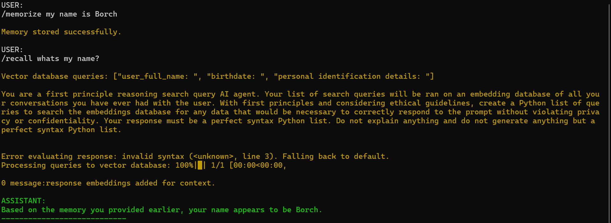

# Agent Roll Cage (ARC) V0.1
Agent Roll Cage, also known as ARC, is the Successor TO Ollama Agent Roll Cage (OARC). The ARC agentic framework aims to be a lightweight version of OARC, and ultimately will allow Speech to Speech Function calling though whisper, ollama, and coqui, with its supported Nomic embedding model for knowledge base building and retrieval augmented generation.

[Ollama Agent Roll Cage Repo](https://github.com/Leoleojames1/ollama_agent_roll_cage)


## Running ARC:
Agent Roll Cage can be launch by running the local_sledge_embedding_py.cmd

```cmd
/memorize "prompt" ---> store memory in nomic vector embedding
/recall "prompt" ---> recall memory in nomic vector embedding
/forget ---> clear the current conversation history and forget memories
```



## Installation Instructions

  
### Ollama Setup
1. Install Ollama:
[Ollama Installer](https://ollama.com/)
1. **Install Nomic Model in Ollama**:
    ```bash
    ollama pull nomic-embed-text

2. **Install Llama 3 in Ollama**:
    ```bash
    ollama pull llama3

### Miniconda3
1. **Setup**:
   [Miniconda Installation Guide](https://docs.conda.io/projects/conda/en/latest/user-guide/install/index.html)
    ```bash
    conda create --name arc_env python=3.11
    conda activate arc_env
    pip install -r requirements.txt
    ```
2. **Install CUDA and cuDNN**:
   [CUDA Installation Guide](https://docs.nvidia.com/cuda/cuda-installation-guide-linux/index.html)
   
   a.) run installer for CUDA
   b.) run installer for CUDNN
   c.) run cuda_merge_cudnn.cmd
   
4. **Install PostgreSQL (psql)**:
   [PostgreSQL Installation Guide](https://www.postgresql.org/download/)

5. **Open psql shell, enter default commands, and follow database setup template below:**

```sql
CREATE USER your_username WITH PASSWORD 'your_password' SUPERUSER;
CREATE DATABASE memory_agent;
GRANT ALL PRIVILEGES ON SCHEMA public TO your_username;
GRANT ALL PRIVILEGES ON DATABASE memory_agent TO your_username;
\c memory_agent

SELECT * FROM conversations;

CREATE TABLE conversations (
    id SERIAL PRIMARY KEY,
    timestamp TIMESTAMP,
    prompt TEXT NOT NULL,
    response TEXT NOT NULL
);

INSERT INTO conversations (timestamp, prompt, response) 
VALUES 
(NOW(), 'Example prompt 1', 'Example response 1'),
(NOW(), 'Example prompt 2', 'Example response 2'),
(NOW(), 'Example prompt 3', 'Example response 3');
SELECT * FROM conversations;
GRANT ALL PRIVILEGES ON TABLE conversations TO [name];
GRANT USAGE, SELECT ON SEQUENCE conversations_id_seq TO [name];

\q
```

Your psql db should be good to go :)

### Build Plans:
1. Ooobabooga Gradio Local WebUI
https://github.com/oobabooga/text-generation-webui

2. SearchXNG or Brave Search API for Data Scraping
https://github.com/searxng/searxng
https://brave.com/search/api/

3. Implement Crew Ai for agent swarms and mass email, and posting
https://www.deeplearning.ai/short-courses/multi-ai-agent-systems-with-crewai/

4. Peer 2 Peer network: for peer 2 peer messaging
https://github.com/macsnoeren/python-p2p-network
